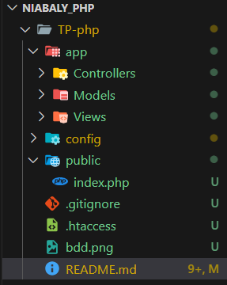
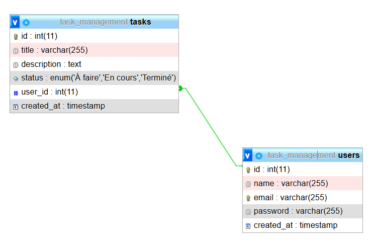

# Projet de Gestion de Tâches Collaborative

## Description du Projet
Ce projet est un système de gestion de tâches collaboratives développé en PHP suivant l'architecture MVC (Modèle-Vue-Contrôleur). Il permet aux utilisateurs de créer un compte, de se connecter, et de gérer leurs tâches personnelles avec différents statuts.

## Fonctionnalités
- Inscription et connexion des utilisateurs
- Création, lecture, mise à jour et suppression de tâches (CRUD)
- Affichage des tâches par utilisateur
- Gestion des statuts de tâches (À faire, En cours, Terminé)

## Structure du Projet
Le projet suit une architecture MVC. Voici la structure détaillée des dossiers :



### Organisation des dossiers :
- `app/` : Contient les composants principaux de l'application
  - `Controllers/` : Gère la logique de l'application
  - `Models/` : Gère les interactions avec la base de données
  - `Views/` : Contient les fichiers de présentation
- `config/` : Contient les fichiers de configuration
- `public/` : Point d'entrée de l'application
- Fichiers à la racine : .gitignore, .htaccess, README.md

## Structure de la Base de Données



### Tables
1. **users**
   - id (INT, Primary Key)
   - name (VARCHAR(255))
   - email (VARCHAR(255))
   - password (VARCHAR(255))
   - created_at (TIMESTAMP)

2. **tasks**
   - id (INT, Primary Key)
   - title (VARCHAR(255))
   - description (TEXT)
   - status (ENUM: 'À faire', 'En cours', 'Terminé')
   - user_id (INT, Foreign Key)
   - created_at (TIMESTAMP)

### Commandes Git utilisées
```bash
# Clonage du projet
git clone https://github.com/Abdou586/TP-php.git
# Initialisation du projet
git init
git add .
git commit -m "feat: Initial commit - Structure MVC de base"
git branch -M main
git push -u origin main

# Ajout des fonctionnalités de base
git add .
git commit -m "feat: Ajout des modèles User et Task"
git push origin main

git add README.md
git commit -m "Docs: Ajout du README détaillé avec structure du projet "
git push origin main

# Ajout des images au README
git add README.md
git commit -m "docs: Mise à jour du README avec schémas et captures d'écran"
git push origin main

## Installation
1. Clonez le dépôt :
   ```bash
   git clone https://github.com/Abdou586/TP-php.git